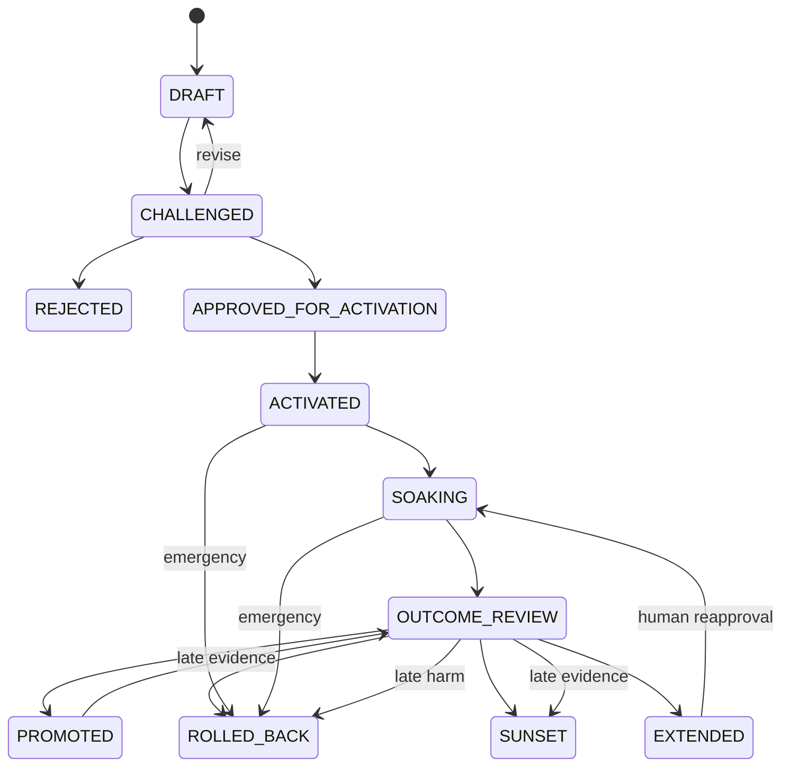

# Human-Gated Evolution of Agent Instructions and Workflows

> **Authority and parity:** This document governs the evidence-informed evolution of versioned agent instructions and workflows without overriding a concrete skill or workflow's own execution contract. English is canonical. The Ukrainian localization MUST be a semantic 1:1 match. Any semantic EN/UK mismatch blocks release.

## Scope and Epistemic Limits

This is a human-gated process for changing versioned instructions, tools, orchestration, evaluation, and operating procedures. It is not model-weight training, autonomous self-certification, or proof of universal improvement. Document design and governance can be validated now; operational efficacy requires future outcome evidence. Numeric 9-10 self-ratings are not evidence and MUST NOT be used as an approval basis.

Risk determines governance and controls; claim type determines the evidence method. Use the least costly lane that satisfies both. Uncertainty about classification uses the stronger lane. Models may propose, challenge, advise, or grade, but model consensus is advisory: only humans approve activation and promotion.

## Proportional Governance Lanes

### Editorial

Use for spelling, formatting, links, or clarification with no semantic effect. It requires normal review, basic validation, and EN/UK parity checking. It requires no change record, soak, Design Critic, or Oracle. If review discovers possible semantic effect, reclassify before activation.

### Compact Observational

This is the default for bounded, reversible semantic changes. It MUST have one independent challenge, with disagreement and disposition preserved. Oracle review is used only for material uncertainty or unresolved disagreement. A human MUST approve an exact revision and activation identity before bounded activation. The change then receives a predeclared soak and human outcome review.

The author may also be the operator only where local constraints require it and the recorded challenge remains independent. This exception never relaxes human approval, exact identity, rollback, soak, or outcome review, and cannot be used to evade High-assurance separation.

### High-Assurance

Use for high-risk changes and for changes to defaults, gates, roles, models, evaluation, security, permissions, destructive behavior, or cross-project behavior. A Design Critic and Oracle MUST provide advisory reviews in separate contexts. The record MUST name a non-author evaluation owner and a human approver distinct from the author and activator/operator. If this independence cannot be satisfied, reject or narrow the change.

Before approval, record hazard, reversibility, and blast-radius analysis; use relevant pre-activation mechanisms and guardrails; bound activation so it is reversible; and verify a deployable rollback target. Relevant mechanisms include existing threat models, deterministic/static checks, replay or simulation, sandbox or dry-run execution, and adversarial validation. Irreversible residual effects require a `compensating_action`; unacceptable irreversible high-risk changes MUST be rejected or narrowed.

High assurance does not automatically require a controlled comparison. Controlled comparison is required only for a controlled or causal effect claim.

## Identity and Approval Contract

- `change_id`: stable human-readable identity across pre-activation revisions.
- `revision_identity`: exact Git identity of the proposed artifact revision.
- `activation_identity`: only relevant runtime dimensions: content/revision, activation mechanism, model and host/orchestrator versions, plus relevant toolset, configuration, permissions, and environment references. Record `UNKNOWN` or `MISSING` explicitly.
- `mechanism_scope`: stable description of the behavior or outcome the change can affect.
- `approval_record_identity`: immutable digest or reference covering the approved lane, scope, risk analysis, roles, revision and activation identities, rollback/compensation, guardrails, soak plan, and decision conditions.
- `rollback_target`: restorable configuration containing artifact revision, activation mechanism, and relevant runtime identity; a bare SHA is insufficient.
- `compensating_action`: required handling for irreversible residual effects.

Before activation, any change to an approved `revision_identity` or `activation_identity`, or any material change to the payload covered by `approval_record_identity`, invalidates approval and returns the record to `DRAFT`. After activation, any such material drift immediately stops evidence accrual. Evidence collected after the drift is invalid for outcome assessment and remains only as incident evidence. Appending observations without changing approved terms does not. Git is the version authority.

## Lifecycle and Dispositions

Emergency rollback or deactivation from `ACTIVATED` or `SOAKING` is mandatory on guardrail breach, observability loss, or post-activation drift in `revision_identity`, `activation_identity`, or the approved payload. Approval withdrawal or expiry is a disposition returning to `DRAFT` or `REJECTED`, not a state. Direct disposition is allowed only before activation; afterward, verified rollback or deactivation is a prerequisite before the record can return to `DRAFT` and seek fresh approval. Superseding a `PROMOTED` change is `SUNSET` with `closure_reason=SUPERSEDED`. Each `EXTENDED` decision MUST have explicit human reapproval, a new review date, a reason, and remain within the predeclared `extension_limit`. A rolled-back retry uses a new `change_id` and records `retry_of`.

Rejected, invalid, inconclusive, harmful, rolled-back, and sunset outcomes remain in the registry; they are not silently discarded.

## Evidence and Claim Contract

### Motivation and outcome fields

`motivation_status` is exactly one of:

`OBSERVED_SINGLE | OBSERVED_RECURRING | PREVENTIVE_RISK | MANDATED | OPPORTUNITY`

Outcome fields are orthogonal:

- `evidence_strength`: `UNASSESSED | INSUFFICIENT | OBSERVATIONAL | LONGITUDINAL | CONTROLLED`
- `effect_direction`: `UNKNOWN | BENEFICIAL | NEUTRAL | MIXED | HARMFUL`
- `claim_scope`: `mechanism_scope`, task classes, projects/environments, versions, and explicit exclusions.

### Combination and wording rules

- `UNASSESSED` or `INSUFFICIENT` requires `effect_direction=UNKNOWN`.
- `OBSERVATIONAL` and `LONGITUDINAL` MUST NOT support causal wording.
- `LONGITUDINAL` requires prospective observations in predeclared strata, sufficient denominator coverage, no material guardrail breach, and explicit confounder review.
- `CONTROLLED` is allowed only after a valid, prespecified controlled comparison with an isolated intervention, comparison or replay, concurrent-change control, defined metrics and stops, and scoped uncertainty analysis.
- Controlled causal wording is limited to “effect demonstrated within” the named scope, never universal proof.
- Motivating or development evidence cannot independently confirm its own efficacy. Outcome evidence MUST postdate activation and have a distinct evidence identity. A motivating case may become a regression case, but is not independent outcome evidence.
- Negative, invalid, and inconclusive results MUST be preserved. Grader disagreement is retained and investigated, not automatically averaged away.

Rate or trend claims require the unit, eligibility rule, window, deduplication rule, denominator, and missingness. Cost fields are required only for cost or efficiency claims; generalization fields only for claims beyond directly observed scope. Measure what you claim.

## Evidence Hygiene and Independence

Every evidence item MUST record immutable identity/reference, provenance, source/project/task, relevant version, time, collection context, and sanitization. Minimize data before storage. Secrets, credentials, PII, customer payloads, raw prompt exports, and third-party full content MUST NOT enter Git; store only minimal sanitized excerpts or derived facts, with sensitive sources in approved access-controlled systems.

Semantically deduplicate without losing occurrence counts. Never overwrite admitted evidence; corrections are append-only and link the superseded identity. Evidence roles MUST be separate as `DEVELOPMENT`, `REGRESSION`, and `OUTCOME`, or be unambiguously derivable.

Different prompts, personas, or sessions from the same model family are not independent empirical evidence. Cross-model review can diversify challenge but cannot replace deterministic checks, a named evaluation owner where required, or human authority. No agent or council may self-certify, self-approve, or self-promote.

## Soak, Overlap, and Observability

A soak MUST predeclare eligibility, observation window, guardrails, stop conditions, review date, and `extension_limit`. Every eligible task is reflected in the durable coverage tally defined by the results registry.

Planned simultaneous soaks for the same `mechanism_scope` are forbidden. Only unplanned or technically unavoidable overlap may be classified as forced. A forced unresolved overlap MUST have a human incident disposition, record its reason and time bounds, list every relevant `change_id`, stop or roll back one soak when safely possible, and cap `evidence_strength` at `OBSERVATIONAL`. Loss of observability fails closed: roll back and set outcome `evidence_strength=INSUFFICIENT` and `effect_direction=UNKNOWN`. Missing or unknown observations never count as success.

## Repository Boundaries

Git is the version authority. `results/` is the durable change/outcome registry and longitudinal index, not raw evidence storage or a telemetry database. Task-local `.tmp` ledgers remain uncommitted and non-authoritative. Do not add a new storage, versioning, or instrumentation system.

Existing `rp-loop-engineering` and `rp-capstone-review` may be referenced for their own execution and release contracts; they are not efficacy graders and their procedures MUST NOT be duplicated here. Existing backups support activation safety only when applicable.

## Optional Empirical Annex

Use controlled comparison only when the intended claim is controlled or causal, or when uncertainty warrants it. A suitable design may freeze a baseline B0 and candidate C1, isolate one intervention, use paired shadow runs, a held-out corpus, deterministic/model/human graders, or a bounded canary. Pilot ranges such as 3-5 runs and corpus heuristics such as 20-50 tasks are planning aids, not sufficiency thresholds.

None of B0/C1, paired shadow, held-out corpus, canary, a full model council, or those numeric heuristics is a default universal requirement. When used, freeze relevant artifacts before observation, prevent candidate access to hidden answers, control concurrent changes and infrastructure noise, preserve failures and traces, and follow a predeclared rerun policy. An invalid or inconclusive comparison cannot justify promotion; archive it after allowed retries are exhausted.

## References and Epistemic Labels

- **Official practice:** Anthropic, [Demystifying evals for AI agents](https://www.anthropic.com/engineering/demystifying-evals-for-ai-agents) and [Quantifying infrastructure noise in agentic coding evals](https://www.anthropic.com/engineering/infrastructure-noise), on realistic evaluation, trace review, graders, and infrastructure controls.
- **Official practice:** NIST, [AI Risk Management Framework](https://www.nist.gov/itl/ai-risk-management-framework), on governed risk management and human accountability.
- **Primary research:** Madaan et al., [Self-Refine](https://arxiv.org/abs/2303.17651), supports iterative self-feedback for some output-improvement settings; it does not establish self-certification, operational governance efficacy, or universal improvement.
- **Primary research:** Lipsitch, Tchetgen Tchetgen, and Cohen, [Negative controls: a tool for detecting confounding and bias in observational studies](https://doi.org/10.1097/EDE.0b013e3181d61eeb), explains how negative controls can reveal bias but do not turn observational evidence into causal proof.
- **Cookbook governance extrapolation:** the lanes, lifecycle, identities, evidence combinations, overlap cap, and registry contract are local normative safeguards derived from risk-management and evaluation principles; their design can be checked now, while efficacy claims await scoped future evidence.
