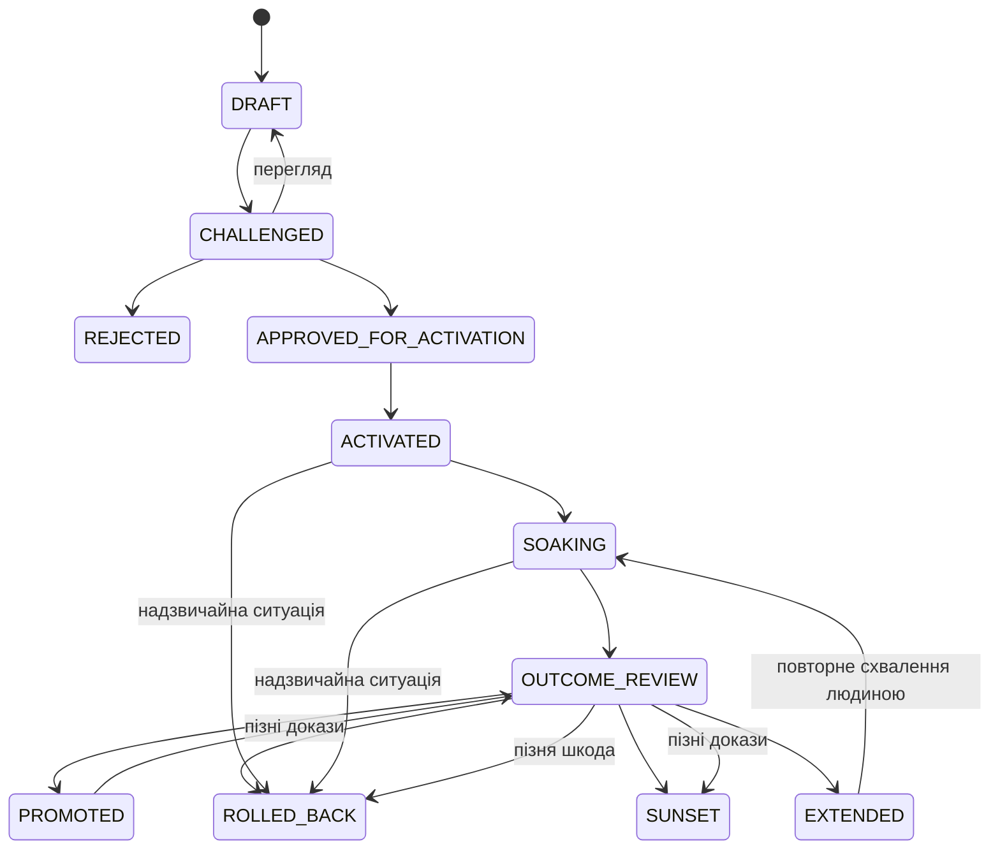

# Керована людиною еволюція інструкцій і робочих процесів агентів

> **Нормативна сила та паритет:** Цей документ регулює інформовану доказами еволюцію версійованих інструкцій і робочих процесів агентів, не скасовуючи власного контракту виконання конкретної навички чи робочого процесу. Англійська версія є канонічною. Українська локалізація MUST бути семантичною відповідністю 1:1. Будь-яка семантична розбіжність EN/UK блокує реліз.

## Сфера та епістемічні обмеження

Це керований людиною процес зміни версійованих інструкцій, інструментів, оркестрації, оцінювання та операційних процедур. Це не навчання ваг моделі, не автономна самосертифікація й не доказ універсального поліпшення. Дизайн документа та врядування можна перевірити зараз; операційна ефективність потребує майбутніх доказів результатів. Числові самооцінки 9-10 не є доказами й MUST NOT використовуватися як підстава для схвалення.

Ризик визначає врядування та засоби контролю; тип твердження визначає метод доказування. Використовуйте найменш витратний lane, що задовольняє обидва аспекти. Невизначеність щодо класифікації вимагає суворішого lane. Моделі можуть пропонувати, критично перевіряти, радити чи оцінювати, але консенсус моделей має дорадчий характер: лише люди схвалюють активацію та просування.

## Пропорційні lanes врядування

### Editorial

Використовуйте для правопису, форматування, посилань або уточнень без семантичного впливу. Цей lane вимагає звичайного рев'ю, базової валідації та перевірки паритету EN/UK. Він не вимагає запису зміни, soak, Design Critic або Oracle. Якщо рев'ю виявляє можливий семантичний вплив, перекласифікуйте зміну до активації.

### Compact Observational

Це типовий lane для обмежених і зворотних семантичних змін. Він MUST мати одну незалежну критичну перевірку зі збереженням розбіжності та її disposition. Oracle-рев'ю застосовують лише за істотної невизначеності або невирішеної розбіжності. До обмеженої активації людина MUST схвалити точні ідентичності ревізії та активації. Після цього зміна проходить попередньо оголошений soak і людське outcome review.

Автор також може бути оператором лише там, де цього вимагають локальні обмеження, а зафіксована критична перевірка залишається незалежною. Цей виняток ніколи не послаблює людське схвалення, точну ідентичність, відкат, soak або outcome review і не може використовуватися для обходу розподілу ролей High-assurance.

### High-Assurance

Використовуйте для змін високого ризику та змін defaults, gates, ролей, моделей, оцінювання, безпеки, дозволів, руйнівної поведінки або міжпроєктної поведінки. Design Critic і Oracle MUST надати дорадчі рев'ю в окремих контекстах. Запис MUST назвати evaluation owner, який не є автором, і approver-людину, відмінну від автора й activator/operator. Якщо таку незалежність неможливо забезпечити, відхиліть або звузьте зміну.

До схвалення зафіксуйте аналіз небезпек, зворотності та blast radius; застосуйте релевантні механізми до активації та guardrails; обмежте активацію так, щоб вона була зворотною; і перевірте deployable rollback target. Релевантні механізми охоплюють наявні threat models, детерміновані/статичні перевірки, replay або simulation, sandbox або dry-run виконання та adversarial validation. Незворотні залишкові наслідки вимагають `compensating_action`; неприйнятні незворотні зміни високого ризику MUST бути відхилені або звужені.

High assurance не вимагає контрольованого порівняння автоматично. Контрольоване порівняння потрібне лише для твердження про контрольований або причинний ефект.

## Контракт ідентичності та схвалення

- `change_id`: стабільна, читабельна для людини ідентичність упродовж ревізій до активації.
- `revision_identity`: точна Git-ідентичність запропонованої ревізії артефакту.
- `activation_identity`: лише релевантні runtime-виміри: вміст/ревізія, механізм активації, версії моделі та host/orchestrator, а також релевантні посилання на toolset, конфігурацію, дозволи й середовище. Явно записуйте `UNKNOWN` або `MISSING`.
- `mechanism_scope`: стабільний опис поведінки або результату, на які може вплинути зміна.
- `approval_record_identity`: незмінний digest або посилання, що охоплює схвалені lane, сферу, аналіз ризику, ролі, ідентичності ревізії та активації, відкат/компенсацію, guardrails, soak-план і умови рішення.
- `rollback_target`: відновлювана конфігурація, що містить ревізію артефакту, механізм активації та релевантну runtime-ідентичність; самого SHA недостатньо.
- `compensating_action`: обов'язкова обробка незворотних залишкових наслідків.

До активації будь-яка зміна схвалених `revision_identity` або `activation_identity` чи будь-яка істотна зміна payload, охопленого `approval_record_identity`, скасовує схвалення та повертає запис до `DRAFT`. Після активації будь-який такий істотний drift негайно припиняє накопичення доказів. Докази, зібрані після drift, невалідні для оцінювання результату й залишаються лише доказами інциденту. Додавання спостережень без зміни схвалених умов цього не робить. Git є джерелом істини щодо версій.

## Життєвий цикл і dispositions

Надзвичайний відкат або деактивація зі стану `ACTIVATED` або `SOAKING` обов'язкові в разі порушення guardrail, втрати спостережуваності або drift після активації в `revision_identity`, `activation_identity` чи схваленому payload. Відкликання або сплив схвалення є disposition, що повертає до `DRAFT` або `REJECTED`, а не станом. Пряме застосування disposition дозволене лише до активації; після неї перевірений відкат або деактивація є передумовою повернення запису до `DRAFT` і запиту нового схвалення. Заміна зміни зі статусом `PROMOTED` — це `SUNSET` із `closure_reason=SUPERSEDED`. Кожне рішення `EXTENDED` MUST мати явне повторне схвалення людиною, нову дату рев'ю, причину й залишатися в межах попередньо оголошеного `extension_limit`. Повторна спроба після відкату використовує новий `change_id` і записує `retry_of`.

Відхилені, невалідні, непереконливі, шкідливі, відкочені та sunset-результати залишаються в реєстрі; їх не відкидають мовчки.

## Контракт доказів і тверджень

### Поля мотивації та результату

`motivation_status` має рівно одне зі значень:

`OBSERVED_SINGLE | OBSERVED_RECURRING | PREVENTIVE_RISK | MANDATED | OPPORTUNITY`

Поля результату є ортогональними:

- `evidence_strength`: `UNASSESSED | INSUFFICIENT | OBSERVATIONAL | LONGITUDINAL | CONTROLLED`
- `effect_direction`: `UNKNOWN | BENEFICIAL | NEUTRAL | MIXED | HARMFUL`
- `claim_scope`: `mechanism_scope`, класи завдань, проєкти/середовища, версії та явні винятки.

### Правила комбінацій і формулювань

- `UNASSESSED` або `INSUFFICIENT` вимагає `effect_direction=UNKNOWN`.
- `OBSERVATIONAL` і `LONGITUDINAL` MUST NOT підтримувати причинні формулювання.
- `LONGITUDINAL` вимагає проспективних спостережень у попередньо оголошених strata, достатнього denominator coverage, відсутності істотного порушення guardrail і явного рев'ю confounders.
- `CONTROLLED` дозволено лише після валідного, попередньо специфікованого контрольованого порівняння з ізольованим втручанням, порівнянням або replay, контролем одночасних змін, визначеними метриками й stop-умовами та аналізом невизначеності в заданій сфері.
- Контрольоване причинне формулювання обмежене твердженням «ефект продемонстровано в межах» названої сфери, а не універсальним доказом.
- Мотиваційні докази або докази розробки не можуть незалежно підтвердити власну ефективність. Outcome evidence MUST датуватися після активації та мати окрему evidence identity. Мотиваційний випадок може стати regression case, але не є незалежним outcome evidence.
- Негативні, невалідні та непереконливі результати MUST зберігатися. Розбіжності graders зберігають і досліджують, а не усереднюють автоматично.

Твердження про частоту або тренд вимагають одиниці, правила eligibility, вікна, правила дедуплікації, denominator і missingness. Поля вартості обов'язкові лише для тверджень про вартість або ефективність; поля узагальнення — лише для тверджень поза безпосередньо спостережуваною сферою. Вимірюйте те, що стверджуєте.

## Гігієна та незалежність доказів

Кожен елемент доказів MUST фіксувати незмінну ідентичність/посилання, походження, джерело/проєкт/завдання, релевантну версію, час, контекст збирання та санітизацію. Мінімізуйте дані до зберігання. Secrets, credentials, PII, customer payloads, raw prompt exports і повний сторонній вміст MUST NOT потрапляти до Git; зберігайте лише мінімальні санітизовані уривки або похідні факти, а чутливі джерела — у схвалених системах із контрольованим доступом.

Семантично дедуплікуйте, не втрачаючи кількості випадків. Ніколи не перезаписуйте допущені докази; виправлення є append-only і посилаються на замінену ідентичність. Ролі доказів MUST бути розділені як `DEVELOPMENT`, `REGRESSION` та `OUTCOME` або однозначно виводитися.

Різні промпти, персони або сесії того самого сімейства моделей не є незалежними емпіричними доказами. Cross-model рев'ю може урізноманітнити критичну перевірку, але не може замінити детерміновані перевірки, названого evaluation owner там, де він потрібний, або людські повноваження. Жоден агент або council не може самосертифікуватися, самосхвалюватися чи самопросуватися.

## Soak, overlap і спостережуваність

Soak MUST попередньо оголосити eligibility, вікно спостереження, guardrails, stop-умови, дату рев'ю та `extension_limit`. Кожне eligible-завдання відображається в довготривалому coverage tally, визначеному реєстром результатів.

Заплановані одночасні soaks для того самого `mechanism_scope` заборонені. Лише незапланований або технічно неминучий overlap можна класифікувати як вимушений. Вимушений невирішений overlap MUST мати людську incident disposition, фіксувати причину й часові межі, перелічити кожен релевантний `change_id`, зупинити або відкотити один soak, коли це можна зробити безпечно, та обмежувати `evidence_strength` до `OBSERVATIONAL`. Втрата спостережуваності завершується безпечно: виконайте відкат і встановіть для результату `evidence_strength=INSUFFICIENT` та `effect_direction=UNKNOWN`. Відсутні або невідомі спостереження ніколи не рахуються як успіх.

## Межі репозиторію

Git є джерелом істини щодо версій. `results/` є довготривалим реєстром змін/результатів і поздовжнім індексом, а не сховищем raw evidence чи telemetry database. Task-local `.tmp` ledgers залишаються незакоміченими й неавторитетними. Не додавайте нової системи зберігання, версіонування чи інструментування.

Наявні `rp-loop-engineering` і `rp-capstone-review` можна згадувати для їхніх власних контрактів виконання та релізу; вони не є graders ефективності, і їхні процедури MUST NOT дублюватися тут. Наявні backups підтримують безпеку активації лише тоді, коли це застосовно.

## Необов'язковий емпіричний додаток

Використовуйте контрольоване порівняння лише тоді, коли заплановане твердження є контрольованим або причинним чи коли цього потребує невизначеність. Придатний дизайн може зафіксувати baseline B0 і candidate C1, ізолювати одне втручання, використати paired shadow runs, held-out corpus, deterministic/model/human graders або bounded canary. Пілотні діапазони на кшталт 3-5 запусків і корпусні евристики на кшталт 20-50 завдань є допоміжними орієнтирами планування, а не порогами достатності.

Жоден із B0/C1, paired shadow, held-out corpus, canary, повного model council або цих числових евристик не є типовою універсальною вимогою. Якщо їх використовують, зафіксуйте релевантні артефакти до спостереження, не надавайте кандидату доступ до прихованих відповідей, контролюйте одночасні зміни та інфраструктурний шум, зберігайте відмови й трейси та дотримуйтеся попередньо оголошеної політики повторних запусків. Невалідне або непереконливе порівняння не може виправдати просування; архівуйте його після вичерпання дозволених повторних спроб.

## Джерела та епістемічні позначки

- **Офіційна практика:** Anthropic, [Demystifying evals for AI agents](https://www.anthropic.com/engineering/demystifying-evals-for-ai-agents) і [Quantifying infrastructure noise in agentic coding evals](https://www.anthropic.com/engineering/infrastructure-noise), про реалістичне оцінювання, рев'ю трейсів, graders і контроль інфраструктури.
- **Офіційна практика:** NIST, [AI Risk Management Framework](https://www.nist.gov/itl/ai-risk-management-framework), про кероване управління ризиками та людську відповідальність.
- **Первинне дослідження:** Madaan et al., [Self-Refine](https://arxiv.org/abs/2303.17651), підтримує ітеративний self-feedback у деяких умовах поліпшення результатів; воно не встановлює самосертифікацію, ефективність операційного врядування чи універсальне поліпшення.
- **Первинне дослідження:** Lipsitch, Tchetgen Tchetgen і Cohen, [Negative controls: a tool for detecting confounding and bias in observational studies](https://doi.org/10.1097/EDE.0b013e3181d61eeb), пояснює, як negative controls можуть виявити bias, але не перетворюють observational evidence на причинний доказ.
- **Екстраполяція врядування cookbook:** lanes, життєвий цикл, ідентичності, комбінації доказів, обмеження overlap і контракт реєстру є локальними нормативними запобіжниками, виведеними з принципів управління ризиками й оцінювання; їхній дизайн можна перевірити зараз, тоді як твердження про ефективність очікують на обмежені сферою майбутні докази.
