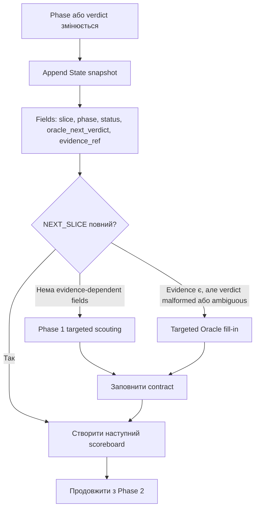
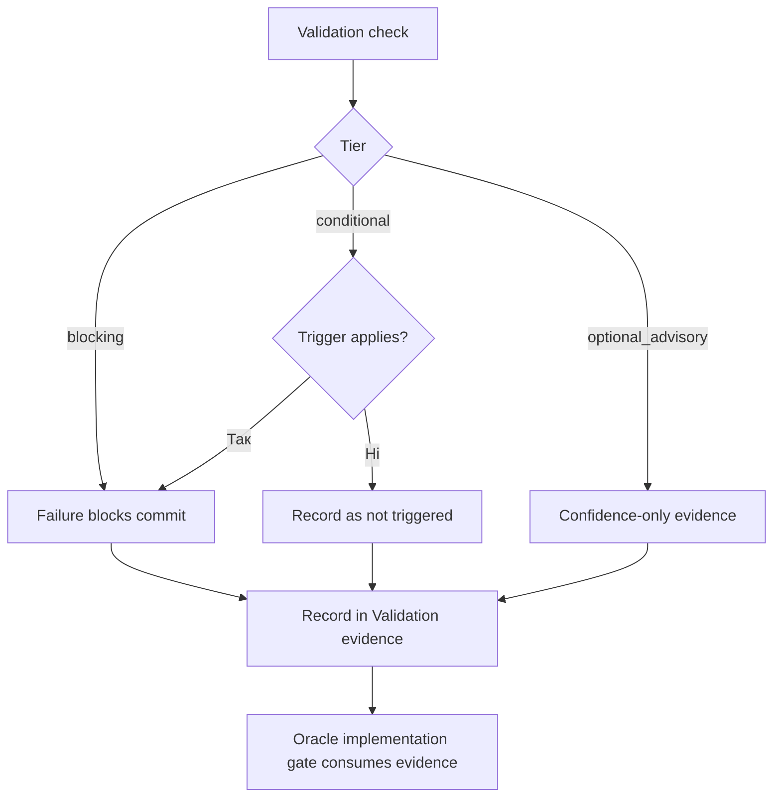
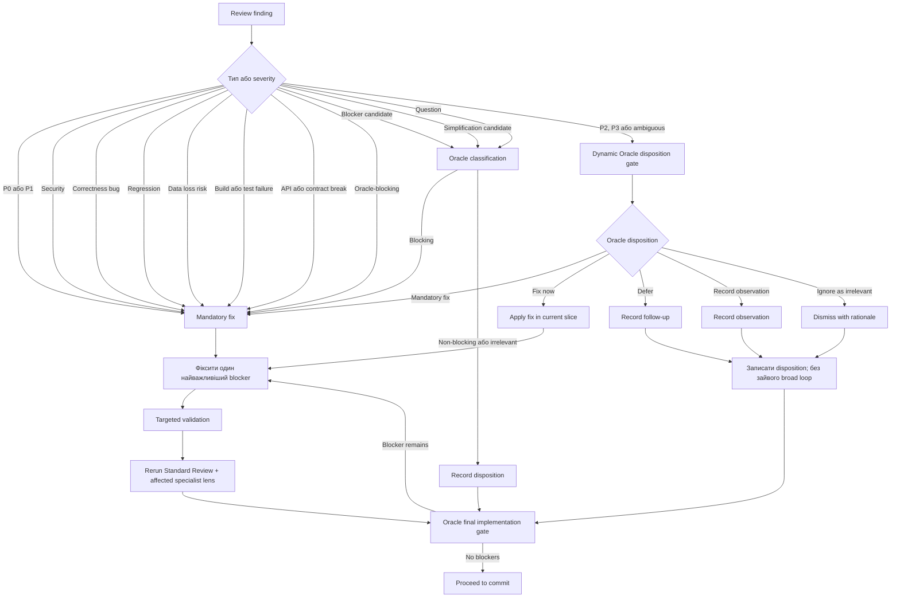
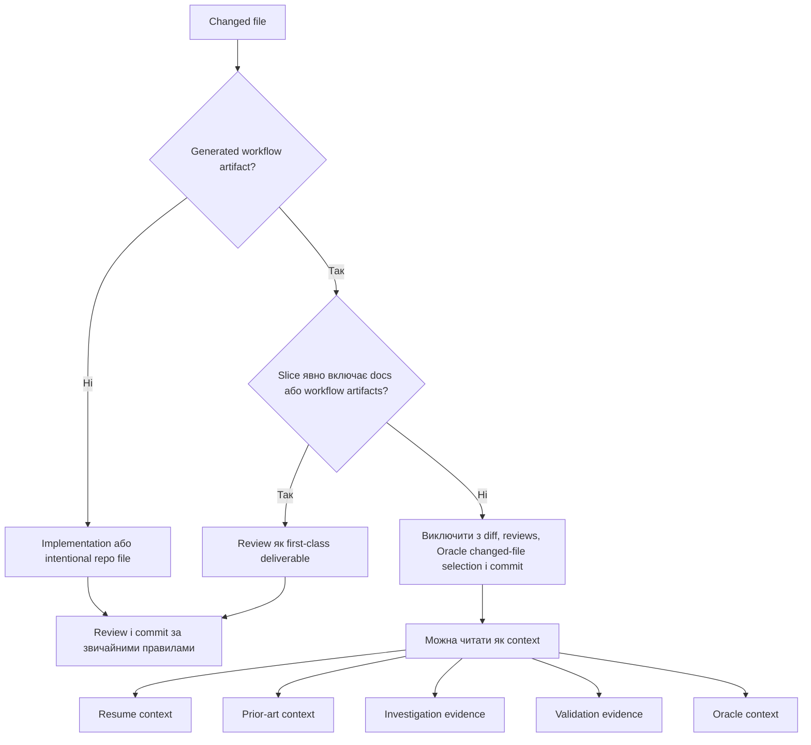

# RepoPrompt CE Autonomous Slice Workflow

Цей документ є схемою для актуального workflow `Autonomous Slice Loop + Specialist Reviews`, який зберігається в `workflows/repoprompt-ce/autonomous-slice-loop-specialist-reviews.md`.

Оновлюйте цей документ разом із workflow, якщо змінюються фази, gates, Oracle-виклики, validation behavior, review loops, artifact policy, commit behavior або next-slice behavior.

## Повний цикл

```mermaid
flowchart TD
  A["Старт: сирий запит"] --> B["Фаза 0: перевірка workspace"]
  B --> C["Фаза 0.5: resume scan"]

  C --> D{"Є попередній стан?"}
  D -->|Ні| F["Фаза 1: вибрати наступний slice"]
  D -->|Так| E{"Resume classification"}

  E -->|Plan exists, not approved| I["Фаза 4: Plan Review loop"]
  E -->|Plan approved, no engineer spec| J["Фаза 5: Engineer Oracle spec"]
  E -->|Engineer spec exists, no orchestration row| K["Фаза 6: Orchestrate implementation"]
  E -->|Uncommitted implementation, no clean Oracle verdict| L["Фаза 7: Implementation Review loop"]
  E -->|Clean Oracle verdict, no commit hash| Y["Фаза 8: Commit"]
  E -->|Commit exists, no next-slice verdict| Z["Фаза 9: Next-slice gate"]
  E -->|NEXT_SLICE з повним contract| AC["Створити scoreboard наступного slice"]
  E -->|NEXT_SLICE без contract| AD["Повернутися до Фази 1"]
  E -->|No usable artifacts| F

  F --> F1["Перекласти запит у repo-терміни"]
  F1 --> F2["Запустити explore scouts"]
  F2 --> F3["Обрати dependency-correct slice"]
  F3 --> F4["Створити scoreboard"]
  F4 --> F5["Додати append-only state snapshot"]

  F5 --> G["Фаза 2: exa-cli checkpoint"]
  G --> G1{"Є зовнішні факти?"}
  G1 -->|Так| G2["exa-cli docs і code-examples"]
  G1 -->|Ні| G3["Записати: exa не потрібен"]
  G2 --> H["Фаза 3: Deep Plan"]
  G3 --> H

  H --> H1["Нормалізувати plan у prompt-exports"]
  H1 --> H2["Design critique"]
  H2 --> H3["Oracle: plan readiness"]
  H3 --> H4{"Plan ready?"}
  H4 -->|Ні| H5["Виправити gap або зібрати evidence"]
  H5 --> H3
  H4 -->|Так| I

  I --> I1["Standard Review плану"]
  I1 --> I2["Oracle plan approval + design critique"]
  I2 --> I3{"Plan approved?"}
  I3 -->|Ні| I4["Виправити найважливіший plan blocker"]
  I4 --> I1
  I3 -->|Так| J

  J --> J1["Oracle пише implementation spec"]
  J1 --> J2["Зберегти spec у prompt-exports"]
  J2 --> J3["Oracle: spec consistency"]
  J3 --> J4{"Spec consistent?"}
  J4 -->|Ні| J5["Перегенерувати або поправити spec"]
  J5 --> J3
  J4 -->|Plan insufficient| I
  J4 -->|Так| K

  K --> K1["Реалізувати approved slice"]
  K1 --> K2["Класифікувати validation tiers"]
  K2 --> K3["Запустити validation commands"]
  K3 --> K4["Записати Validation evidence"]
  K4 --> L

  L --> L1["Git status і diff"]
  L1 --> L2["Виключити generated artifacts, unless explicit include"]
  L2 --> M1["Standard Review implementation"]
  M1 --> M2["rp-ponytail-review"]
  M2 --> M3["rp-thermo-nuclear-code-quality-review"]
  M3 --> M4["Записати Specialist review log"]
  M4 --> N["Нормалізувати findings як evidence"]

  N --> N1{"Finding routing"}
  N1 -->|Mandatory category| V["Фіксити один найважливіший blocker"]
  N1 -->|Blocker candidate, simplification, question| U["Oracle final implementation gate"]
  N1 -->|P2, P3 або ambiguous| O["Dynamic Oracle disposition gate"]

  O --> O1{"Oracle disposition"}
  O1 -->|Mandatory fix| V
  O1 -->|Fix now| V
  O1 -->|Defer| R["Записати follow-up"]
  O1 -->|Record observation| S["Записати спостереження"]
  O1 -->|Ignore as irrelevant| T["Відкинути з rationale"]

  R --> U
  S --> U
  T --> U

  V --> V1["Targeted validation"]
  V1 --> V2["Rerun Standard Review + affected specialist lens"]
  V2 --> U

  U --> U1{"Clean enough?"}
  U1 -->|Ні, є blocker| V
  U1 -->|Cannot tell| W["Зібрати targeted evidence"]
  W --> V2
  U1 -->|Так| X["Зупинити broad review loop"]
  U1 -->|Лише non-blocking P2/P3| X

  X --> Y
  Y --> Y1["Stage тільки slice-intended files"]
  Y1 --> Y2["Не commit-ити generated artifacts без explicit include"]
  Y2 --> Y3["Conventional Commit"]
  Y3 --> Y4["Записати commit hash у scoreboard"]

  Y4 --> Z
  Z --> Z1["Oracle: original goal complete?"]
  Z1 --> Z2{"Oracle verdict"}

  Z2 -->|COMPLETE| AA["Final rollup"]
  Z2 -->|NO_SAFE_UNBLOCKED_SLICE| AB["Final rollup з blocker"]
  Z2 -->|NEXT_SLICE з contract| AC
  Z2 -->|NEXT_SLICE без contract| AD

  AC --> G
  AD --> F
```

`NEXT_SLICE` ніколи не є stop verdict. Якщо verdict задовольняє `State Transition Contract`, workflow створює scoreboard наступного slice і продовжує з Фази 2. Якщо contract неповний, malformed, ambiguous або є тільки назва slice, workflow повертається у Фазу 1 для targeted scouting або робить targeted Oracle fill-in. Final rollup дозволений тільки для `COMPLETE` або `NO_SAFE_UNBLOCKED_SLICE`.

## State і validation contracts

Workflow має компактний YAML-like `State Transition Contract`, але це не автоматичний parser contract. State пишеться в scoreboard як append-only snapshots: старі snapshots не редагуються.

Validation перед implementation класифікується за tiers:

## Пріоритети review findings

Standard Review, `rp-ponytail-review` і `rp-thermo-nuclear-code-quality-review` дають evidence, а не фінальний verdict. Oracle вирішує, чи finding є blocking, non-blocking P2/P3 або irrelevant. Clean commit означає нуль Oracle-blocking findings, а не нуль suggestions.

## Правила виключення generated artifacts

Generated workflow artifacts за замовчуванням виключаються з:

- implementation diff;
- Standard Review;
- specialist reviews;
- Oracle changed-file selection;
- commit scope.

Generated workflow artifacts:

- `prompt-exports/`
- `docs/plans/`
- `docs/reviews/`
- `docs/designs/`
- `docs/analysis/`
- `docs/investigation/`
- `docs/investigations/`

