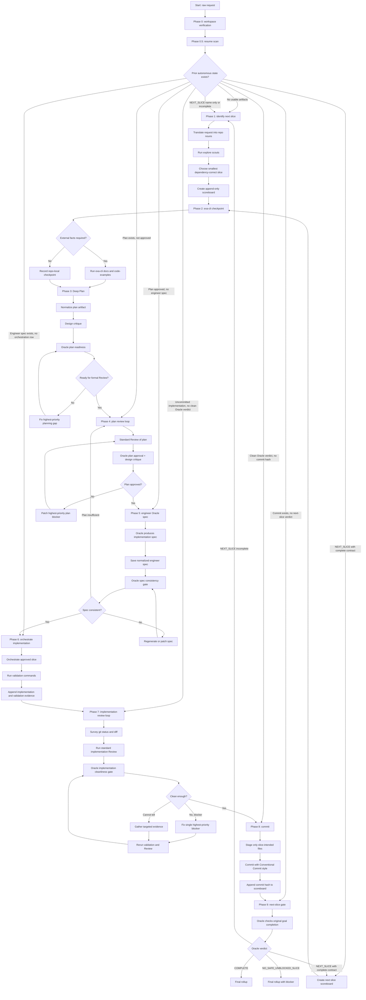
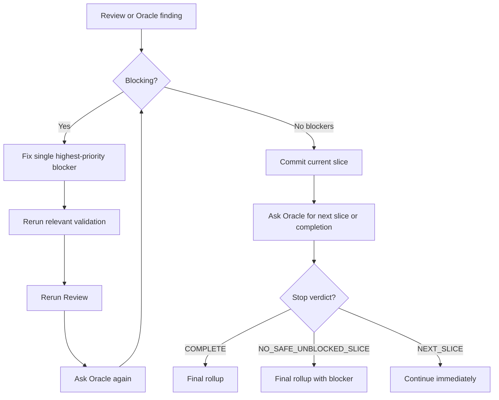
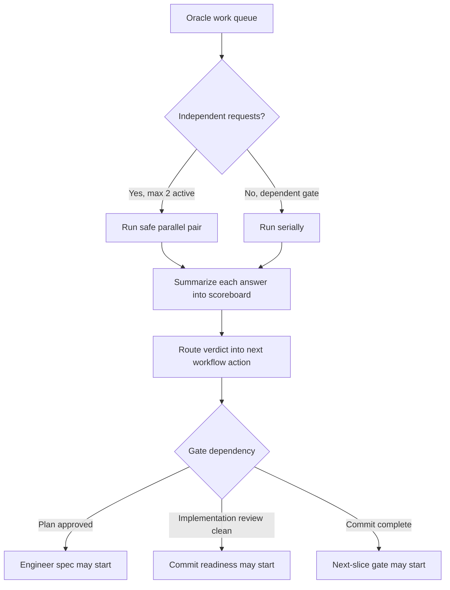
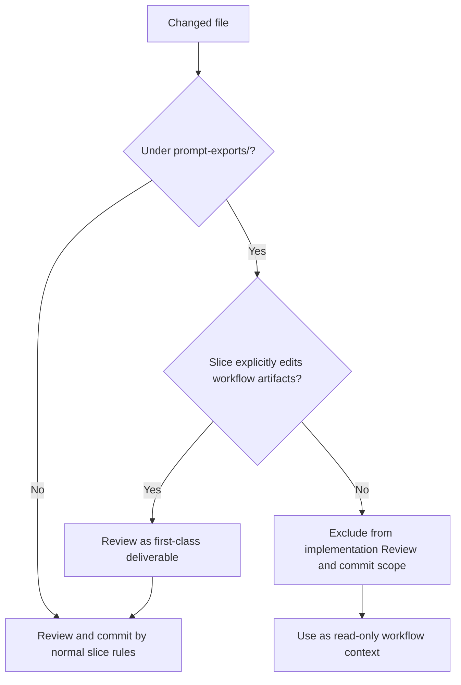

# Autonomous Slice Loop Workflow

This document summarizes the RepoPrompt CE workflow defined in `workflows/repoprompt-ce/autonomous-slice-loop.md`.

Update this document whenever the workflow changes phases, gates, Oracle usage, validation behavior, review loops, commit behavior, or next-slice behavior.

## End-to-End Flow

## Review And Stop Rules

The workflow has no hidden iteration caps for blocking issues. A committed slice is not a stop condition when Oracle says the original goal is not complete.

## Oracle Parallelism

Oracle calls are encouraged, but the workflow keeps them scheduled. At most two independent Oracle conversations or Oracle-export-producing calls should be active at once. Dependent gates stay serial: do not ask for an implementation spec before plan approval, do not ask for commit readiness before implementation review is clean, and do not choose the next slice before the current slice is committed.

## Generated Artifact Policy

The baseline workflow treats `prompt-exports/` orchestration artifacts as workflow state, not implementation code. Scoreboards, normalized plans, and engineer specs may be used as context for resume, planning, validation evidence, and Oracle gates, but they should not pollute implementation review or commit scope unless the current slice explicitly edits workflow artifacts.

