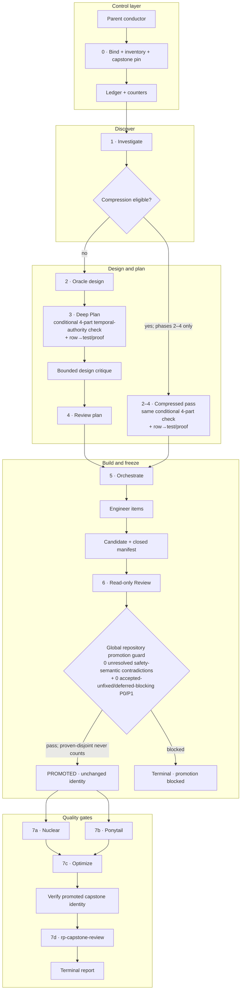
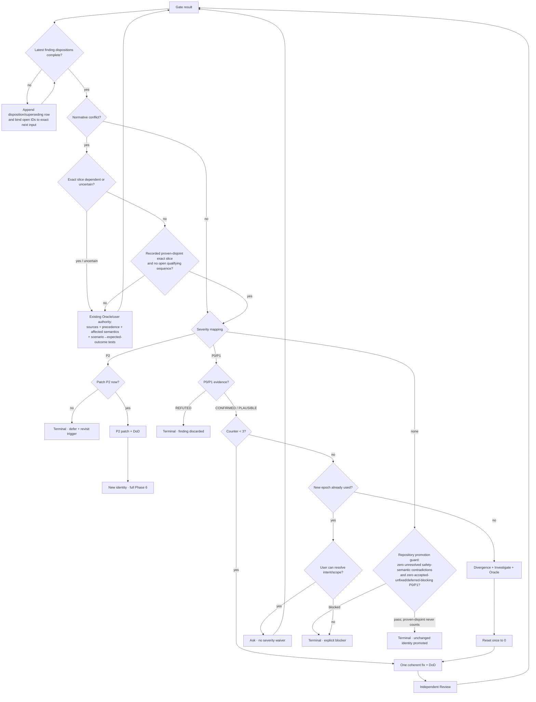

# RP Loop Engineering: operator/architecture guide

> Канонічний контракт: [`skills/rp-loop-engineering/SKILL.md`](../../../skills/rp-loop-engineering/SKILL.md).
> **`SKILL.md` залишається authoritative**; цей guide лише пояснює операційну архітектуру й не створює другого нормативного контракту.

## Authority та межа conductor/children

Parent conductor є єдиним control plane; authoritative ownership summary наведено в таблиці **Roles та actual child ownership** нижче. Він перевіряє outputs і докази, але не дублює змістовну роботу leaves. У Phase 0 він знаходить і повністю читає `rp-capstone-review/SKILL.md` з addressable cookbook checkout, `~/.agents/skills/` або `~/.claude/skills/` symlink view за canonical verified-skill rules; відсутність або unreadability блокує run.

Child володіє тільки явно переданим scope та результатом свого leaf contract. Звичайні leaves не spawn-ять наступний рівень. Виняток — host-level `rp-capstone-review`: parent викликає його integrated entry point, а verified capstone contract сам володіє lifecycle своїх fresh `pair` children; parent не керує ними externally.

## Overview



Small-task compression вирішується після Phase 1 і стискає **лише phases 2–4**; phases 1 і 5–7 залишаються mandatory. За uncertainty обирається full path; повні eligibility criteria визначає canonical `SKILL.md`.

## Phase internals

<details>
<summary><strong>Phases 1–2 — evidence before design</strong></summary>

- **1 · Investigate:** повертає read-only report із file:line edit-site inventory/root cause; parent записує його artifact identity та рішення про compression.
- Вузький `explore` — одне read-only питання, не review і не implementation.
- **2 · Oracle:** лише для відкритих design-рішень або epoch escalation; operational bounds і terminal ownership — у таблиці нижче та canonical `SKILL.md`.
</details>

<details>
<summary><strong>Phases 3–4 — executable plan and bound verdict</strong></summary>

- **3 · Deep Plan:** повертає plan-only executable artifact, фіксує mandatory involvement choice і виконує built-in bounded design critique; питання додаткового critic лишається deferred нижче.
- Deep Plan і compressed phases 2–4 pass застосовують однакову conditional `temporal-authority` matrix лише за конʼюнкції чотирьох умов: verified fact/reference/token/proof дає authority для publication/mutation/submit/cleanup/attribution; використання стається після `await`, RPC/process boundary, timeout race, cancellation point або окремого irreversible dispatch; object чи authority conditions можуть змінитися незалежно; stale use може пошкодити correctness, ownership, finality або non-replayability.
- Кожен рядок матриці планує deterministic transition/fault-injection test або, якщо це справді неможливо, фіксує причину й конкретний evidence-backed non-testable proof. Conductor перевіряє row→test/proof coverage до запуску Phase 4, а Review — як plan completeness. Матриця живе всередині plan artifact або наявного design-authority document і покривається hash цього наявного manifest member; нового artifact/member немає. Якщо plausible випадок перевірено, але predicate не виконався, ledger стисло називає першу невиконану умову без per-function/per-`await` N/A ceremony.
- **4 · Review:** `pair` перевіряє plan artifact проти folded critique, inventory і design authority.
- Parent створює content-hash manifest усіх Phase-4 inputs. Verdict `no P0-P1` діє лише для цього manifest; зміна будь-якого member вимагає нового Review.
</details>

<details>
<summary><strong>Phase 5 — bounded implementation</strong></summary>

- Parent формує для `Orchestrate` **не більш як 5 items** і додає до кожного exact commit requirement та applicable DoD.
- `Orchestrate` володіє декомпозицією й прямим dispatch `engineer`; engineers не spawn-ять дітей.
- Після кожної адекватної зміни: DoD, окремий conventional commit, потім parent independently verifies commands, scope і per-commit stat.
- Stall: два незмінні long-poll windows дозволяють steer; лише positive idle/no-progress evidence дозволяє cancel і **один** fresh narrower retry. Повторний доведений stall — blocker.
</details>

<details>
<summary><strong>Phases 6–7 — immutable review and capstone</strong></summary>

- **6 · Review:** immutable/read-only gate; freeze semantics наведені в секції Evidence нижче.
- **7:** nuclear і ponytail запускаються паралельно як окремі `pair` leaves на promoted identity; child/context ownership визначає таблиця нижче.
- `Optimize` завжди виконує Phase-1 scouting; далі serial loop з cap **5** лише за measurable metric/hot path, інакше explicit evidence-backed N/A.
- У Phase 0 parent pin-ить один capstone contract; повний record входить у closed manifest до candidate capture й через його digest — у candidate/promoted identity.
- Безпосередньо перед фінальним host-level integrated entry point parent re-resolve/recheck-ить promoted capstone identity та виконує contract лише з exact щойно перевірених bytes. Mismatch блокує frozen run; replacement потребує нового Phase-0 run. Повні record/recheck rules — у canonical [`SKILL.md`](../../../skills/rp-loop-engineering/SKILL.md).
- Parent передає complete promoted Phase-6 record/manifest і immutable known-context records з їхніми digests та full canonical root/base/head; capstone сам володіє lifecycle внутрішніх fresh `pair` children.
- Normative conflict блокує dependent або uncertain slice до наявного Oracle/user resolution record. Лише recorded proven-disjoint exact slice, що evidence-backed обирає neither outcome, може далі пройти severity/patch/review, і лише коли немає open qualifying remediation sequence; це не змінює DoD, commit, invalidation, re-review, counter чи partial-attempt rules.
- Окремо перед `PROMOTED` repository release-candidate gate вимагає у всьому governed scope нуль unresolved safety-semantic contradictions і нуль accepted-unfixed або deferred-blocking P0/P1. Proven-disjoint transition не задовольняє, не обходить і не waive-ить цей global blocker та не дозволяє promotion dependent slice.
</details>

## Roles та actual child ownership

| Surface | Actual owner | Bound |
|---|---|---|
| Routing, user I/O, identities/manifests, counters, severity, escalation/stop, workflow roots | Parent | Exact registered names; no aliases by resemblance |
| Narrow investigation probe | `explore` | One read-only question |
| Oracle conversation | Parent | 1–3 substantive; 2 consecutive non-substantive |
| Built-in plan critique | `Deep Plan` | Built-in and bounded; extra critic is a deferred decision |
| Bounded plan critic | `design` | Gaps/contradictions/order only, never rewrite; an additional critic after Deep Plan remains deferred |
| Complex review/work | `pair` | Read-only Review; code review is git-diff-oriented; stop on ambiguous scope |
| Implementation children | `Orchestrate` → `engineer` | ≤5 parent-authored items; no grandchildren |
| Nuclear/Ponytail review context | Individual leaves | Leaves own `context_builder`; parent pins promoted identity and maps severity |
| Performance loop | `Optimize` | Serial, cap 5 |
| Final capstone | Parent invokes verified `rp-capstone-review` at host level | Integrated entry point; capstone owns child lifecycle; no external leaf wrapping/retry |

Required workflow identities are verbatim: `Investigate`, `Deep Plan`, `Review`, `Orchestrate`, `Optimize`. Для conductor-launched leaves поза capstone один misfire (zero tool use/immediate exit) permits exactly one fresh relaunch per leaf per gate run; a second misfire blocks the phase. Internal capstone attempts належать лише його verified lifecycle contract.

## Bounds, remediation та terminal branches

Qualifying cycle — завершена P0/P1 remediation sequence; точні counting/exclusion rules визначає canonical `SKILL.md`.



Plan і code counters незалежні: **3 qualifying cycles на epoch** і максимум **одна нова epoch**; решту reset/terminal semantics визначає canonical `SKILL.md`. Confirmed P0/P1 не можна waive навіть user intent.

## Evidence, freeze та invalidation

Closed manifest обмежує inputs/actors, щоб Phase 6 read-only перевірила одну immutable candidate identity. До candidate capture кожна base→head changed gitlink мусить мати immutable already-reviewed exact transition contract і record/digest у manifest за verified `rp-capstone-review`; інакше Phase 6 блокується. `no P0-P1` плюс unchanged proof promote-ить саме цю identity без recapture. Релевантна mutation інвалідовує evidence й запускає canonical DoD/candidate/full-Phase-6/promotion/Phase-7 rerun; точні predicates, contract schema, identity fields і restart details див. у canonical `SKILL.md`.

Ledger залишається non-authoritative й має лише режими **PROVEN EXCLUDED** або **CLEAN GATE WORKTREE**; їхні predicates і disposition rules визначає canonical `SKILL.md`. Лише finding table у цьому загалом mutable ledger є append-only: для поточного bounded finding-bearing output кожна material finding мусить мати latest disposition, а correction додає superseding row замість переписування історії. До closure не дозволено наступний patch чи Oracle/reviewer scope; exact next input перелічує всі latest-open IDs з disposition evidence. Original output та parent in-session adjudication лишаються authoritative, а resumed run спершу закриває latest still-active bounded output.

## Do-not-duplicate matrix

Any parent-side strengthening must be explicit and reference child contracts rather than copy them.

| Ownership-table boundary | Forbidden duplication |
|---|---|
| Control plane | Інші layers не дублюють його decisions |
| Investigation, plan, Review | Parent/critic/supplemental verify не підміняють artifact owner або gate |
| Implementation | Parent не імплементує leaf scope |
| Review context | Parent не перебудовує architecture/deletion context замість owner |
| Performance | N/A не імітує performance loop |
| Capstone | Parent не дублює повний protocol і не керує internal leaves замість verified `rp-capstone-review` contract |

## Canonical paths

- Cookbook authority: `skills/rp-loop-engineering/SKILL.md`.
- Individual review contracts: `skills/rp-thermo-nuclear-code-quality-review/SKILL.md`, `skills/rp-ponytail-review/SKILL.md`, `skills/rp-capstone-review/SKILL.md`.
- RepoPrompt workflow sources: `workflows/repoprompt-ce/WorkflowPrompt.swift`, `Investigate.swift`, `DeepPlan.swift`, `Review.swift`, `Orchestrate.swift`, `Optimize.swift` у тому самому каталозі.
- Host discovery wrappers: `~/.agents/skills/<name>/SKILL.md` і `~/.claude/skills/<name>/SKILL.md` для чотирьох cookbook skills вище. Це рівноправні wrapper/symlink views, не окрема authority.

## Deferred NON-BLOCKING decisions

| Decision (not fixed policy) | Revisit trigger |
|---|---|
| Phase-4 plan review через git-diff mode | Review contract набуде документного diff scope без змішування code comparison |
| Чи дублює bounded critic можливості Deep Plan | З'явиться evidence про еквівалентний critic output/provenance |
| Mandatory interaction у Deep Plan | Canonical workflow явно гарантуватиме/вимагатиме interaction semantics |
| Stale `~/.codex/prompts/rp-review.md` | Будь-який active wrapper почне на нього посилатися або host inventory зміниться |

Deferred item завжди має rationale, owner і revisit trigger у ledger; до trigger він не блокує run і не стає implicit policy.

## Compact explanatory progress

Це explanatory status only, не новий gate або normative record.

```text
Phase: {n}/7 ({state}); exact identity: {candidate/promoted ID}.
Counters: plan={x}/3@e{n}, code={y}/3@e{n}; blocker: {none або concrete blocker}.
Next gate: {gate}; remaining slices: {count/list}.
```
