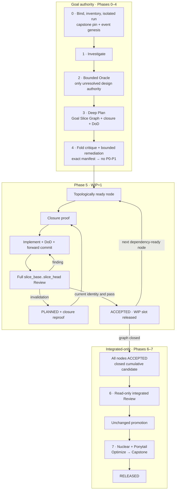
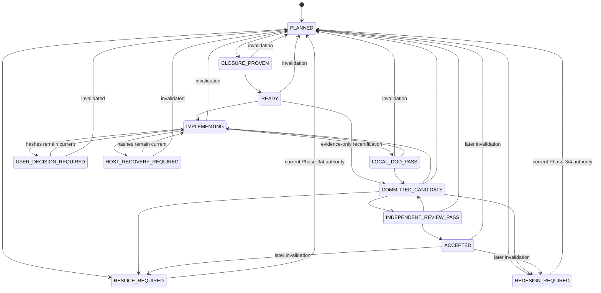
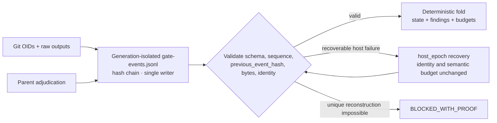

# RP Loop Engineering: операторський та архітектурний гайд

> Канонічний контракт: [`skills/rp-loop-engineering/SKILL.md`](../../../skills/rp-loop-engineering/SKILL.md).
> Цей локалізований гайд лише пояснює контракт. Clause IDs, стани, ліміти, тригери,
> переходи, invalidation і release-рішення визначає тільки `SKILL.md` (`AUTH-1`).

## Що змінилося

Phase 0 лишається bootstrap перед сімома execution phases 1–7. Conductor збережено, але Phase 5 тепер виконує затверджений
**Goal Slice Graph** по одному вузлу. Невелика задача — це graph з одним node, а не окрема
скорочена lifecycle-гілка. Slice acceptance створює перевірену накопичувальну commit history,
але не promotion і не release. Повний closed-manifest freeze, Phase 6, Phase 7 і capstone
починаються тільки після `ACCEPTED` усіх nodes (`GRAPH-2`, `FREEZE-1`, `RELEASE-1`).

## Дворівневий lifecycle



`RELEASED` і `BLOCKED_WITH_PROOF` — єдині goal terminals. `USER_DECISION_REQUIRED` та
`HOST_RECOVERY_REQUIRED` зупиняють scheduler, але run залишається resumable (`TERM-1`).

## Authority та ownership

| Факт або дія | Власник |
|---|---|
| Git OID і фактична поведінка | Git та незалежна validation |
| Raw child verdict/evidence | Immutable output bytes |
| Severity і disposition | Parent conductor events |
| State, counters, readiness | Deterministic fold validated event chain |
| Lifecycle, budgets, triggers, promotion | Canonical skill clauses |
| Capstone internals | Pinned `rp-capstone-review/SKILL.md` |
| Пояснення і схеми | Цей guide, без нормативної сили |

Parent координує й незалежно перевіряє, але не імплементує leaf scope (`AUTH-1`).
Workflow names і roles беруться verbatim із RepoPrompt inventory; схожа назва не є alias.
Повний verified `SKILL.md` може бути fallback лише за `LAUNCH-1`. `CAPSTONE-1` pin-ить exact `skills/rp-ponytail-review/SKILL.md` і `skills/rp-thermo-nuclear-code-quality-review/SKILL.md`; кожен specialist gate запускає fresh registered `pair` через `agent_run`, який читає й виконує весь reverified contract verbatim. Same-name registry/workflow/composite не є substitute. Oracle має bounded design role за `ORACLE-1` і не може waive finding, trigger або gate.

## Phases 0–4: від goal до затвердженого graph

Phase 0 створює чистий isolated worktree на dedicated non-published branch без upstream,
фіксує `run_base`, забороняє history rewrite після записаного OID та pin-ить точні bytes
capstone contract (`RUN-1`, `RUN-2`, `LAUNCH-2`).

`Investigate` знаходить root cause, edit sites, прямі consumers і dynamic wiring.
`Deep Plan` перетворює це на acyclic graph. Кожен node має один `owned_transition`, один
boolean `done_when`, stable `behavior_id`, decomposition-specific `slice_id`, dependencies,
closure record, validation contract і risk tags (`GRAPH-1`).

Phase-4 Review бачить canonical manifest. Для кожного member у ньому є role, immutable path,
byte length і SHA-256. Окремий `folded_critique` member містить точні bytes критики після
folding прийнятих findings. Відсутність або зміна member анулює launch/verdict (`PLAN-1`).
Conditional temporal-authority matrix і конфлікти governing rules закриваються за `PLAN-2`
до того, як affected node стане `READY`.

Окремий Phase-4 plan lineage має manifest-bound budget: три completed P0/P1
correction/re-review cycles на epoch і максимум дві epochs. Перед другою потрібні divergence,
`Investigate` і bounded Oracle; exhaustion веде до legitimate user pause або
`BLOCKED_WITH_PROOF` (`PLAN-3`). Це не створює plan-specific state machine.

## Bounded closure: що саме доводимо

Closure не обіцяє знати весь transitive graph. Це відтворюваний bounded record про surface,
який реально перевірено (`CLOSURE-1`):

```text
expected_write_set:
  - src/codec.go: modify; change the exported decode contract
reverse_dependency_searches:
  - anchor: Decode(
    roots: [src/, tests/]
    result: direct callers classified and evidenced
selecting_tests_fixtures_helpers:
  - tests/codec_contract_test.go
triggered_ci_and_generated_artifacts:
  - repository CI selection recorded
external_consumer_search:
  - present only when acceptance semantics are external
dynamic_discovery:
  - registry/config/reflection signals recorded
closure_hash:
  - RFC 8785 semantic record → SHA-256
```

Якщо registry, reflection, plugin lookup, string/config wiring або runtime discovery лишають
невідомого consumer, disposition стає `DISCOVERY_REQUIRED`. Node не переходить у
`CLOSURE_PROVEN`, доки targeted `Investigate` не включить consumer, не доведе нерелевантність
або не направить graph на re-slice/redesign (`CLOSURE-2`).

Після `READY` перший distinct miss у тому самому behavior lineage дозволяє canonical
expansion/re-review path. Наступний distinct miss є design tripwire: `Investigate` плюс
bounded Oracle ведуть до `RESLICE_REQUIRED` або `REDESIGN_REQUIRED`, не витрачаючи semantic
cycle (`CLOSURE-3`).

## Phase 5: state machine і WIP=1



Схема показує типовий pause/resume з `IMPLEMENTING`; `SLICE-1` додатково дозволяє обидва
pause states з будь-якого nonterminal state, завжди із записаним `resume_state` та hashes.
WIP slot не можна обійти запуском іншого node, поки активний node, remediation або pause не
закрито. Перехід active node у `ACCEPTED` звільняє slot для наступного dependency-ready node.

### Commit range замість mutable candidate

Припустімо, `run_base=A`, перший accepted slice завершився на `B`, а поточний slice зробив
implementation commit `C` і remediation commit `D`:

```text
A --- B --- C --- D
      ^           ^
 slice_base    slice_head
```

Review отримує весь `B..D`, а не лише `D`. Після запису OID не можна amend/rebase/reset;
виправлення додає forward superseding commit. Наступний accepted node починається від нового
`accepted_head`. Зміна `validation_contract` інвалідовує graph evidence: fold зберігає
первинний range base, відступає до maximal contiguous accepted frontier і перевіряє range від
earliest invalidated base до current `HEAD`, включно з affected later commits. Пізніший
`accepted_head` не перетворює recertification на порожній diff (`GRAPH-3`, `SLICE-2`). Так
rejected intermediate work лишається audit-able, але непублікована run branch не видає його
за release (`RUN-2`).

Перед Review profile v1 доводить точний HEAD, чисті index/tracked worktree, дозволений
untracked set, узгоджені submodule/gitlink OIDs та `clean_status_hash`. Повний command list,
canonicalization і normalization належать `SLICE-2`; guide їх не перевизначає.

### Validation та review lenses

Portable DoD включає applicable build/typecheck, scoped static analysis, deterministic tests
і final affected/shared-surface gate. Корисні перевірки пінять external wire format,
override/edge behavior та sentinel/error identity (`DOD-1`).

Standard Review завжди перевіряє correctness, contract, tests, closure і deletion/YAGNI.
Risk predicates у `REVIEW-1` визначають, коли додатково обов’язкові ponytail або
thermo-nuclear через exact contracts у `CAPSTONE-1`. Якщо жодний predicate не спрацював, identity-bound all-false record дає `NOT_APPLICABLE`; provider failure переходить у host recovery, а не в waiver. Speculative policy/abstraction/configurability поза current `done_when` є release-blocking P1: його не можна defer або downgrade, і acceptance/promotion чекають removal та independent re-review (`REVIEW-1`).

## Events, fold, budgets і recovery



`EVENT-1` фіксує chain/event schema v1, canonical JSONL framing, zero-hash genesis,
`null`/`[]` encoding і closed event catalog. `EVENT-2` дає compact event-class→sole-effect
mapping, не дублюючи transition, budget або release predicates з їхніх canonical clauses;
duplicate/stale evidence не просуває fold. `EVENT-3` вимагає materialize exact inline verdict
bytes до parsing, з `output_path`, `output_content_sha256`,
`input_manifest_or_candidate_hash` і verdict. Тому handoff не може мовчки загубити P0/P1.

Phase-4 plan lineage budget належить `PLAN-3`; Phase-5/7 semantic budget належить stable
`behavior_id`, а не `slice_id`. Re-slice, attribution, integration або capstone rerun його не
обнуляють. Qualifying semantic sequence завершує finding → coherent fix → DoD → forward
commit → full-range Review. Closure miss і host failure належать іншим доменам (`BUDGET-1`).
Recurrence triggers описані лише в `BUDGET-2`.

Integrated/capstone finding спочатку отримує `affected_lineages`: один lineage, sorted set
для inseparable multi-lineage fix або stable `GLOBAL` для суто release-boundary defect.
Ambiguity повертає до investigation/design authority; completed sequence charge-ить кожен
lineage без reset (`ATTRIBUTION-1`).

Host failure відкриває `host_epoch` і проходить deterministic ladder із `RECOVERY-1`.
Candidate, closure та semantic budget не змінюються. Кожна chain generation має окремий
append-only path; broken generation seal-иться, а successor genesis посилається на predecessor,
reconstruction і hash-identified imports. Новий genesis ніколи не дописується після damaged
prefix. Late output просуває gate лише коли його candidate/closure/input hashes current.

## Integrated-only freeze і release

Після acceptance всього graph Phase 6 будує один cumulative candidate
`run_base..accepted_head` і closed allowed input/scope manifest. Він охоплює DoD actors,
Review/context inputs, Phase-7 gates, known context, capstone record, untracked/ignored state,
submodules та changed gitlinks (`FREEZE-1`).

`EXCLUDED` означає, що path поза кожною дозволеною traversal/discovery межею або явно
ігнорується кожним actor, і водночас ніким прямо не споживається. Event/output store може
лишитися поза identity тільки як `PROVEN EXCLUDED` або через ізольований
`CLEAN GATE WORKTREE` (`FREEZE-2`).

Phase 6 є read-only. Out-of-manifest access, identity mismatch або mutation скасовують
evidence. Після promotion будь-яка mutation скасовує всі Phase-6/7 gates; відновлення завжди
проходить DoD → new integrated candidate → full Phase 6 → unchanged promotion → усі Phase-7
gates (`FREEZE-3`).

Global promotion guard вимагає відсутності unresolved safety-semantic contradictions, accepted-unfixed/deferred-blocking P0/P1 і speculative generality. На незмінній promoted identity nuclear виконує exact `rp-thermo-nuclear-code-quality-review`, а ponytail — exact `rp-ponytail-review`; далі йдуть `Optimize` та reverified host-level capstone (`CAPSTONE-1`). Лише pass усіх gates
створює `RELEASED` (`RELEASE-1`, `RELEASE-2`).

## Resume і legacy run

Новий run відновлюється fold-ом generation-linked event chains та повторною перевіркою
Git/raw evidence. Старий run із `gate-ledger.md` або завершується під pinned bytes, або
починає fresh generation, чий genesis містить reconstruction/import linkage із source
path/content SHA-256. Legacy ledger і broken generations лишаються read-only; їх не
переписують і після damaged prefix нічого не додають. Missing events не синтезуються з
mutable summaries; неоднозначні attempts рахуються консервативно, а failure унікальної
reconstruction дає `BLOCKED_WITH_PROOF` (`EVENT-1`, `RECOVERY-1`, `MIGRATION-1`).

## Сценарний покажчик

| Сценарії | Canonical clauses |
|---|---|
| Один node, split, dependencies, WIP | `GRAPH-1`, `GRAPH-2` |
| Graph/validation mutation, frontier rollback, total invalidation | `GRAPH-3`, `RUN-2`, `SLICE-2` |
| Phase-4 P0/P1 remediation convergence | `PLAN-1`, `PLAN-3` |
| Dynamic discovery і пропущений consumer | `CLOSURE-1`–`CLOSURE-3` |
| Dirty slice, submodule mismatch, cumulative Review | `SLICE-2`, `REVIEW-1` |
| Remediation, lineage inheritance, exhausted epoch | `SLICE-3`, `BUDGET-1`, `BUDGET-2` |
| Schema/reducer determinism, duplicate/stale/tampered output | `EVENT-1`–`EVENT-3` |
| Broken generation і linked reconstruction/import | `EVENT-1`, `RECOVERY-1`, `MIGRATION-1` |
| Specialist `NOT_APPLICABLE` або provider failure | `REVIEW-1`, `RECOVERY-1` |
| Pause/resume та user-owned decision | `TERM-1`, `SLICE-1`, `ORACLE-1` |
| Integrated/capstone multi-lineage або `GLOBAL` finding | `ATTRIBUTION-1`, `RELEASE-2` |
| Closed manifest, identity mutation, promotion | `FREEZE-1`–`FREEZE-3`, `RELEASE-1` |
| Capstone bytes changed | `LAUNCH-2`, `RELEASE-2` |
| Legacy ledger | `MIGRATION-1` |

## Межі дублювання

- Parent не підміняє verified workflow або leaf contract переказом.
- Per-slice review не копіює integrated freeze ceremony.
- Guide не визначає власні states, caps, triggers, event types або exceptions.
- Loop contract не копіює capstone schema чи lifecycle.
- Пояснювальний diagram не є доказом переходу; ground truth — validated event fold.

## Canonical paths

- Lifecycle authority: `skills/rp-loop-engineering/SKILL.md`.
- Integrated capstone: `skills/rp-capstone-review/SKILL.md`.
- Specialist leaves: `skills/rp-thermo-nuclear-code-quality-review/SKILL.md` і
  `skills/rp-ponytail-review/SKILL.md`.
- Active RepoPrompt workflow sources: `workflows/repoprompt-ce/`.
- Localized descriptive guide: цей файл.

## Fold-derived progress

Операторський status може стисло показувати `run_id`, active `slice_id`/`behavior_id`,
current state, `closure_hash`, semantic lineage epoch/cycles, closure expansion,
`host_epoch`, exact candidate identity, next gate і pause/blocker. Це view результату fold,
не mutable authority (`REPORT-1`).
